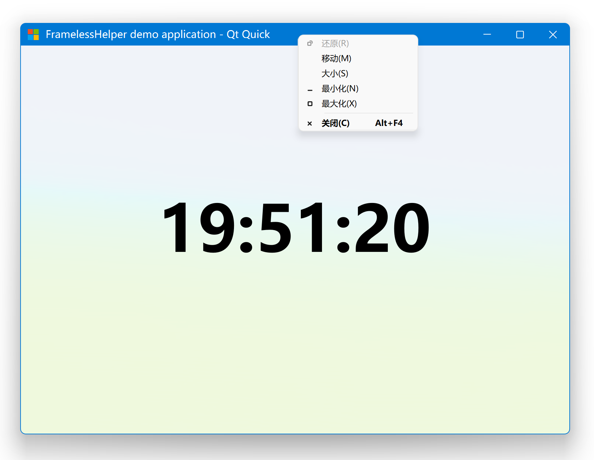
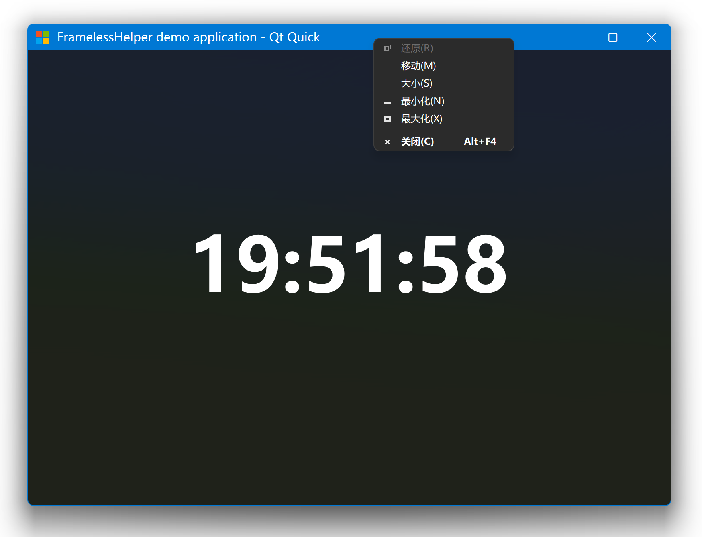
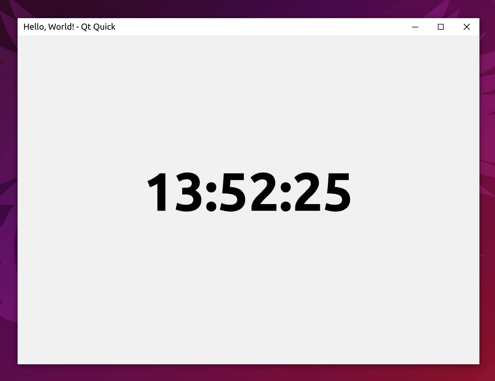
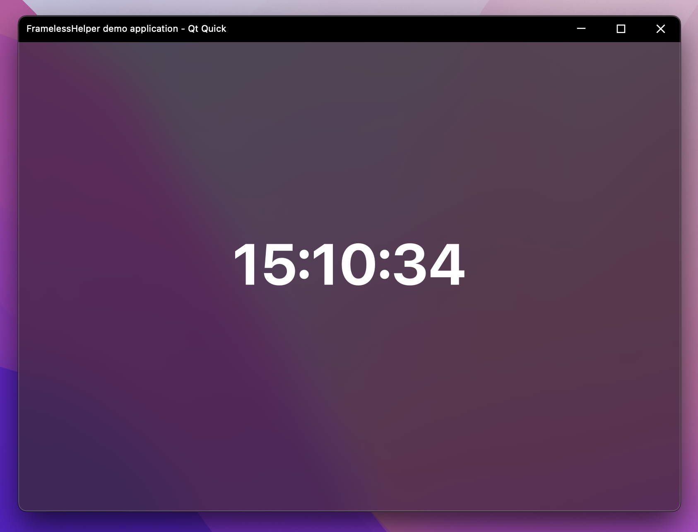

# FramelessHelper 2.0

## Highlights compared to 1.x

- Windows: Gained the ability to only remove the title bar but preserve the window frame at the same time.
- Windows: The flicker and jitter during window resizing is completely gone.
- Windows: The system menu will be opened if you right-click on your custom title bar.
- Windows: Replaced Qt's original system menu with FramelessHelper's homemade one, which looks a lot better than the original one.
- Linux: Removed the limitation of the Qt version. The minimum supported version is lowered to Qt 5.6 now (previously was 5.15).
- macOS: Removed the limitation of the Qt version. The minimum supported version is lowered to Qt 5.6 now (previously was 5.15).
- macOS: The frameless window now supports native resizing.
- Common: Almost completely rewritten of the whole library, it's now a lot more easier to setup your own custom title bar than before.
- Common: Added many more helper functions to allow creating your own custom window easier.
- Misc: Reorganized the project structure to be more like a modern library, it's now a lot more friendly to the library users.
- Misc: Many bugs from the 1.x times are fixed (they were not fixable in 1.x due to technical reasons).

## Screenshots

### Windows





### Linux




### macOS




## Roadmap

- 2.1
  - [ ] All: Add cross-platform system menu for both Qt Widgets and Qt Quick. Support both light and dark theme. Can be triggered by right-clicking on the title bar area or pressing the system menu shortcut (ALT + SPACE).
  - [ ] All: Add QtWebEngine demo applications for both Qt Widgets and Qt Quick.
  - [ ] All: Make more settings and options configurable through environment variables and configuration files.
  - [ ] Windows: Snap layout feature introduced in Windows 11.
- Future versions
  - [ ] Linux: Support runtime theme switching.
  - [ ] Linux: Move window resize area outside of the client area.
  - [ ] More feature requests are welcome!

## Build

```bash
git clone https://github.com/wangwenx190/framelesshelper.git
mkdir build
cd build
cmake -DCMAKE_PREFIX_PATH=<YOUR_QT_SDK_DIR_PATH> -DCMAKE_BUILD_TYPE=Release -GNinja ../framelesshelper
cmake --build . --config Release --target all --parallel
```

**Note**: On Linux you need to install the GTK3 and X11 development packages first.

## Use

For Qt Widgets applications: subclass `FramelessWidget` or `FramelessMainWindow`.

For Qt Quick applications: use `FramelessWindow` instead of `Window`.

Please refer to the demo applications to see more detailed usages: [examples](./examples/)

## Platform Notes

### Windows

- If DWM composition is disabled in some very rare cases (only possible on Windows 7), the top-left corner and top-right corner will appear in round shape. The round corners can be restored to square again if you re-enable DWM composition.
- There's an OpenGL driver bug which will cause some frameless windows have a strange black bar right on top of your homemade title bar, and it also makes the controls in your windows shifted to the bottom-right corner for some pixels. It's a bug of your graphics card driver, specifically, your OpenGL driver, not FramelessHelper. There are some solutions provided by our users but some of them may not work in all conditions, you can pick one from them:
  - Upgrade your graphics card driver to the latest version.
  - Change your system theme to "Basic".
  - If you have multiple graphics cards, try to use another one instead.
  - Force your application use the ANGLE backend instead of the Desktop OpenGL.
  - Force your application use pure software rendering instead of rendering through OpenGL.
  - Or just don't use OpenGL at all, try to use Direct3D/Vulkan/Metal instead.
- Due to there are many sub-versions of Windows 10, it's highly recommended to use the latest version of Windows 10, at least no older than Windows 10 1809. If you try to use this framework on some very old Windows 10 versions such as 1507 or 1607, there may be some compatibility issues. Using this framework on Windows 7 is also supported but not recommended. To get the most stable behavior and the best appearance, you should use it on the latest version of Windows 10 or Windows 11.

### Linux

- FramelessHelper will force your application to use the _XCB_ platform plugin when running on Wayland.
- Currently lacks runtime theme switching support.

### macOS

- The frameless windows will appear in square corners instead of round corners.

## License

```text
MIT License

Copyright (C) 2022 by wangwenx190 (Yuhang Zhao)

Permission is hereby granted, free of charge, to any person obtaining a copy
of this software and associated documentation files (the "Software"), to deal
in the Software without restriction, including without limitation the rights
to use, copy, modify, merge, publish, distribute, sublicense, and/or sell
copies of the Software, and to permit persons to whom the Software is
furnished to do so, subject to the following conditions:

The above copyright notice and this permission notice shall be included in all
copies or substantial portions of the Software.

THE SOFTWARE IS PROVIDED "AS IS", WITHOUT WARRANTY OF ANY KIND, EXPRESS OR
IMPLIED, INCLUDING BUT NOT LIMITED TO THE WARRANTIES OF MERCHANTABILITY,
FITNESS FOR A PARTICULAR PURPOSE AND NONINFRINGEMENT. IN NO EVENT SHALL THE
AUTHORS OR COPYRIGHT HOLDERS BE LIABLE FOR ANY CLAIM, DAMAGES OR OTHER
LIABILITY, WHETHER IN AN ACTION OF CONTRACT, TORT OR OTHERWISE, ARISING FROM,
OUT OF OR IN CONNECTION WITH THE SOFTWARE OR THE USE OR OTHER DEALINGS IN THE
SOFTWARE.
```
